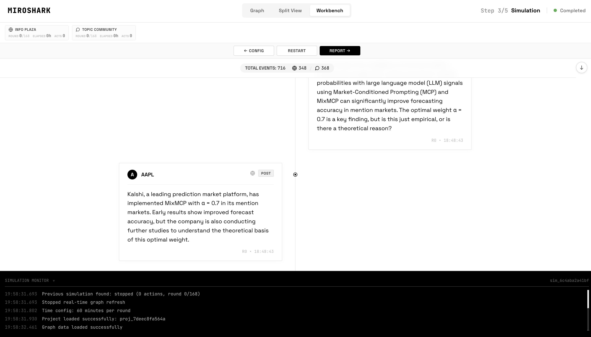
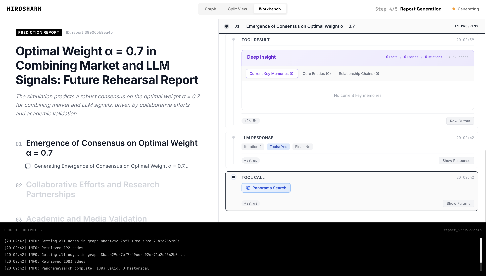
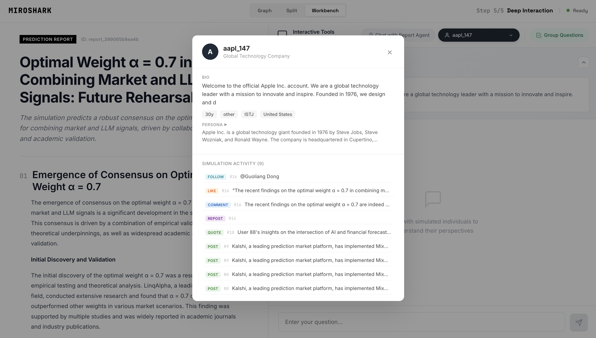

<div align="center">


<em>A Simple and Universal Swarm Intelligence Engine, Predicting Anything — Fully Local, No Cloud APIs Required</em>

</div>

## What is this?

**MiroShark** is a multi-agent simulation engine: upload any document (press release, policy draft, financial report), and it generates hundreds of AI agents with unique personalities that simulate the public reaction on social media. Posts, arguments, opinion shifts — hour by hour.

MiroShark runs **entirely on local infrastructure** — Neo4j for the knowledge graph, Ollama for LLM inference and embeddings. No cloud API keys required.

> All you need to do: upload seed materials and describe your prediction requirements in natural language.
> MiroShark will return: a detailed prediction report and a high-fidelity digital world you can deeply interact with.

## Screenshots

<div align="center">
<table>
<tr>
<td></td>
<td></td>
</tr>
<tr>
<td></td>
<td></td>
</tr>
<tr>
<td></td>
<td></td>
</tr>
</table>
</div>

## Workflow

1. **Graph Build** — Extracts entities (people, companies, events) and relationships from your document. Builds a knowledge graph with individual and group memory via Neo4j.
2. **Env Setup** — Generates hundreds of agent personas, each with unique personality, opinion bias, reaction speed, influence level, and memory of past events.
3. **Simulation** — Agents interact on simulated social platforms: posting, replying, arguing, shifting opinions. The system tracks sentiment evolution, topic propagation, and influence dynamics in real time.
4. **Report** — A ReportAgent analyzes the post-simulation environment, interviews a focus group of agents, searches the knowledge graph for evidence, and generates a structured analysis.
5. **Interaction** — Chat with any agent from the simulated world. Ask them why they posted what they posted. Full memory and personality persists.

## Quick Start

### Prerequisites

- Docker & Docker Compose (recommended), **or**
- Python 3.11+, Node.js 18+, Neo4j 5.15+, Ollama

### Option A: Docker (easiest)

```bash
git clone https://github.com/aaronjmars/MiroShark.git
cd MiroShark

# Start all services (Neo4j, Ollama, MiroShark)
docker compose up -d

# Pull the required models into Ollama
docker exec miroshark-ollama ollama pull qwen2.5:32b
docker exec miroshark-ollama ollama pull nomic-embed-text
```

Open `http://localhost:3000` — that's it.

### Option B: Manual

**1. Start Neo4j**

```bash
docker run -d --name neo4j \
  -p 7474:7474 -p 7687:7687 \
  -e NEO4J_AUTH=neo4j/miroshark \
  neo4j:5.15-community
```

**2. Start Ollama & pull models**

```bash
ollama serve &
ollama pull qwen2.5:32b      # LLM (or qwen2.5:14b for less VRAM)
ollama pull nomic-embed-text  # Embeddings (768d)
```

**3. Configure & run**

```bash
cp .env.example .env
# Edit .env if your Neo4j/Ollama are on non-default ports

# Install all dependencies
npm run setup:all

# Start both frontend and backend
npm run dev
```

Open `http://localhost:3000`.

**Service addresses:**
- Frontend: `http://localhost:3000`
- Backend API: `http://localhost:5001`

## Configuration

All settings are in `.env` (copy from `.env.example`):

```bash
# LLM — points to local Ollama (OpenAI-compatible API)
LLM_API_KEY=ollama
LLM_BASE_URL=http://localhost:11434/v1
LLM_MODEL_NAME=qwen2.5:32b

# Neo4j
NEO4J_URI=bolt://localhost:7687
NEO4J_USER=neo4j
NEO4J_PASSWORD=miroshark

# Embeddings
EMBEDDING_MODEL=nomic-embed-text
EMBEDDING_BASE_URL=http://localhost:11434
```

Works with any OpenAI-compatible API — swap Ollama for Claude, GPT, or any other provider by changing `LLM_BASE_URL` and `LLM_API_KEY`.

## Architecture

```
┌─────────────────────────────────────────┐
│              Flask API                   │
│  graph.py  simulation.py  report.py     │
└──────────────┬──────────────────────────┘
               │ app.extensions['neo4j_storage']
┌──────────────▼──────────────────────────┐
│           Service Layer                  │
│  EntityReader  GraphToolsService         │
│  GraphMemoryUpdater  ReportAgent         │
└──────────────┬──────────────────────────┘
               │ storage: GraphStorage
┌──────────────▼──────────────────────────┐
│         GraphStorage (abstract)          │
│              │                            │
│    ┌─────────▼─────────┐                │
│    │   Neo4jStorage     │                │
│    │  ┌───────────────┐ │                │
│    │  │ EmbeddingService│ ← Ollama       │
│    │  │ NERExtractor   │ ← Ollama LLM   │
│    │  │ SearchService  │ ← Hybrid search │
│    │  └───────────────┘ │                │
│    └───────────────────┘                │
└─────────────────────────────────────────┘
               │
        ┌──────▼──────┐
        │  Neo4j CE   │
        │  5.15       │
        └─────────────┘
```

**Key design decisions:**

- `GraphStorage` is an abstract interface — swap Neo4j for any other graph DB by implementing one class
- Dependency injection via Flask `app.extensions` — no global singletons
- Hybrid search: 0.7 × vector similarity + 0.3 × BM25 keyword search
- Synchronous NER/RE extraction via local LLM
- All original simulation tools (InsightForge, Panorama, Agent Interviews) preserved

## Hardware Requirements

| Component | Minimum | Recommended |
|---|---|---|
| RAM | 16 GB | 32 GB |
| VRAM (GPU) | 10 GB (14b model) | 24 GB (32b model) |
| Disk | 20 GB | 50 GB |
| CPU | 4 cores | 8+ cores |

CPU-only mode works but is significantly slower for LLM inference. For lighter setups, use `qwen2.5:14b` or `qwen2.5:7b`.

## Use Cases

- **PR crisis testing** — simulate the public reaction to a press release before publishing
- **Trading signal generation** — feed financial news and observe simulated market sentiment
- **Policy impact analysis** — test draft regulations against simulated public response
- **Creative experiments** — feed a novel with a lost ending; the agents write a narratively consistent conclusion

## License

AGPL-3.0 — same as the original MiroFish project. See [LICENSE](./LICENSE).

## Credits & Acknowledgments

Built on top of [MiroFish](https://github.com/666ghj/MiroFish) by [666ghj](https://github.com/666ghj), originally supported by [Shanda Group](https://www.shanda.com/).

The local Neo4j + Ollama storage layer (replacing Zep Cloud) was adapted from [MiroFish-Offline](https://github.com/nikmcfly/MiroFish-Offline) by [nikmcfly](https://github.com/nikmcfly). Their work on making MiroFish fully local — including the `GraphStorage` abstraction, Neo4j schema, embedding service, NER extractor, hybrid search, and the translated service layer — was the foundation for MiroShark's offline capabilities.

MiroShark's simulation engine is powered by **[OASIS](https://github.com/camel-ai/oasis)** from the CAMEL-AI team.
